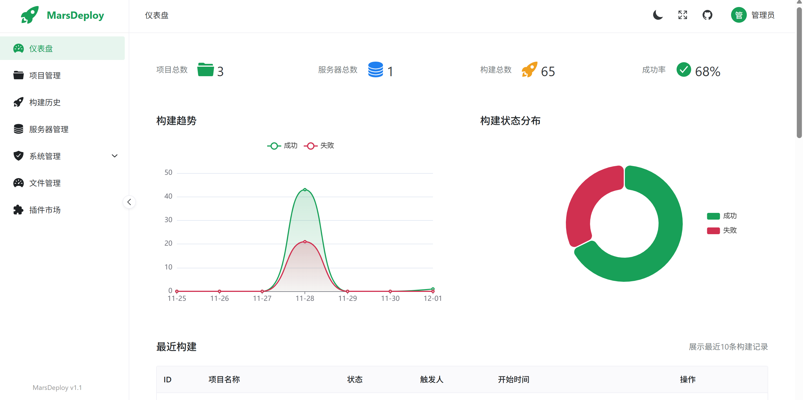
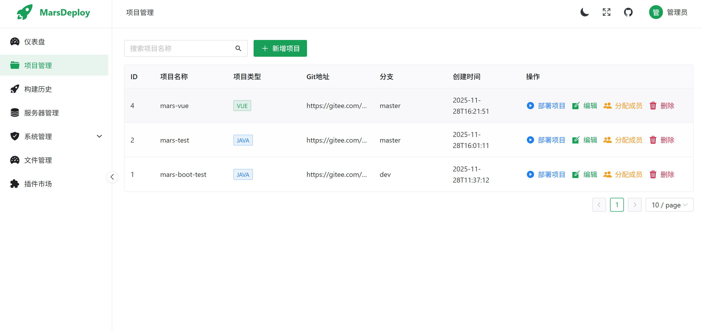
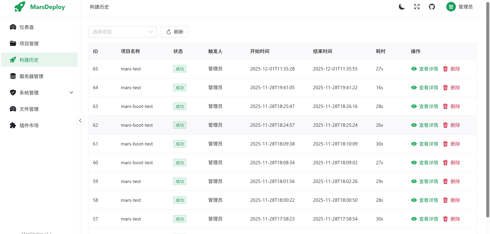
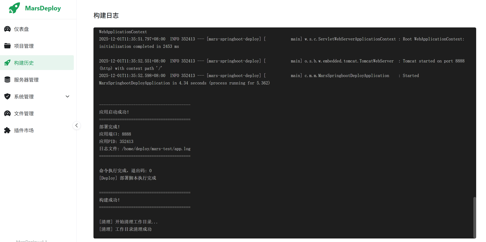
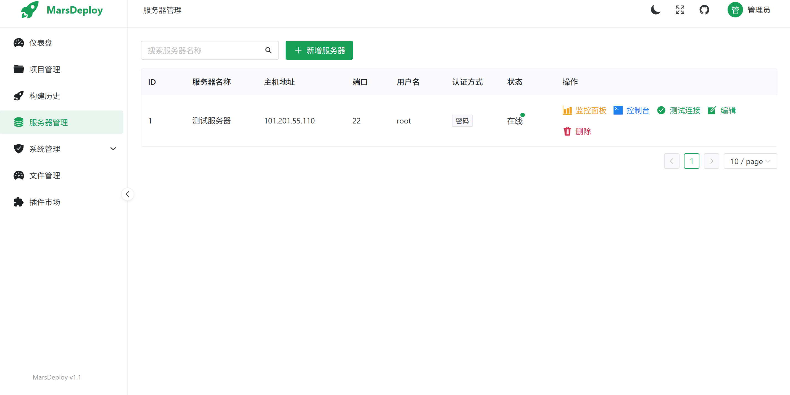
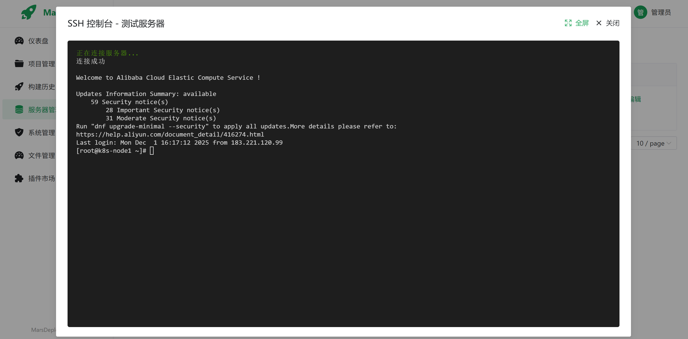
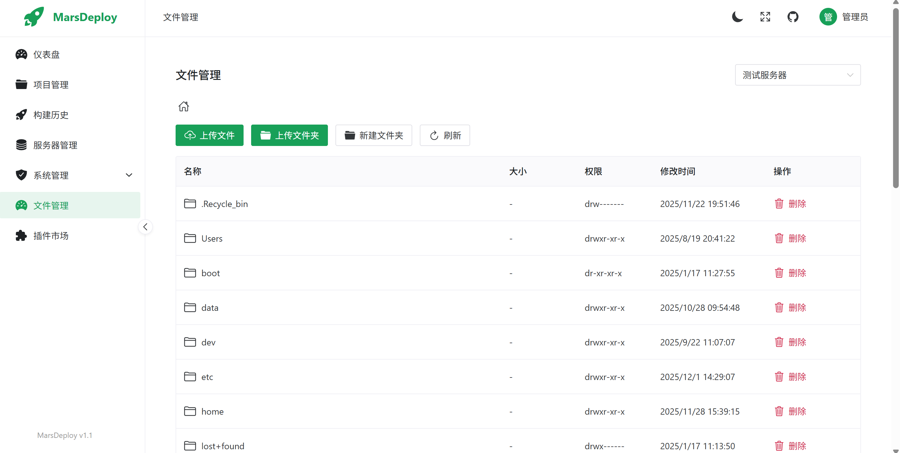
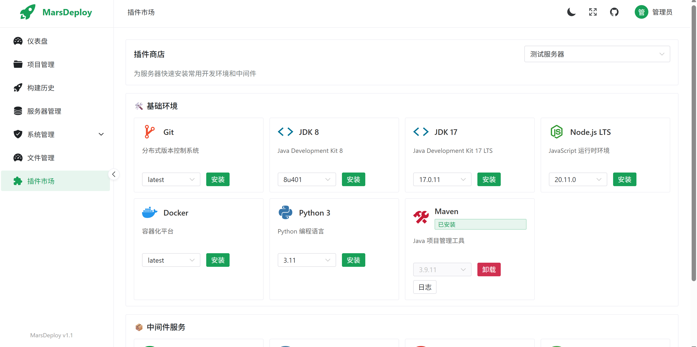

# MarsDeploy - 轻量级 CICD 自动化部署平台

<p align="center">
  
</p>

## 项目简介

MarsDeploy 是一套用于 Java / Vue 项目的自动构建、自动上传、自动部署的平台。提供可视化项目管理、服务器管理、构建任务、实时日志、文件管理、服务器监控等能力。

## 最新更新 🎉

### v1.2.0 (2025-12-02)

- ✨ **文件管理**：支持服务器文件浏览、上传、下载、删除等操作
- 📊 **服务器监控**：新增服务器监控面板，实时查看 CPU、内存、磁盘、网络等统计信息
- 📈 **可视化图表**：监控面板采用 ECharts 仪表盘图表，数据展示更直观
- 🖥️ **全屏模式**：SSH 控制台和监控面板均支持全屏展示
- 🔄 **交互优化**：监控面板支持手动刷新，操作更灵活

### v1.1.0 (2025-12-01)

- 🎨 **主题切换**：支持亮色/暗黑模式自由切换，优化视觉体验
- 🔌 **插件市场**：一键安装基础环境（Git、JDK、Node.js、Docker、Python、Maven）
- 🔌 **插件市场**：一键安装中间件（Nginx、MySQL、Redis、MongoDB）
- 📡 **实时日志**：插件安装/卸载过程 WebSocket 实时日志推送
- ♻️ **失败重试**：支持安装失败后重新安装，自动清理失败记录

## 系统架构

- **前端**：Vue3 + Vite + Naive UI + ECharts + @vicons/ionicons5
- **后端**：Spring Boot 3 + MyBatis-Plus + Sa-Token
- **数据库**：MySQL 8.0
- **其他**：WebSocket、JGit、JSch、xterm.js、JSch

## 核心功能

### 1. 登录权限
- JWT / Sa-Token 鉴权
- 用户权限控制
- 角色管理

### 2. 项目管理
<p align="center">
  
</p>

- 项目新增/编辑
- Git 地址配置
- 分支管理
- 构建命令配置（mvn / npm）
- 产物路径配置
- 绑定服务器
- 多服务器部署支持

### 3. 构建任务管理
<p align="center">
  
</p>

- 一键触发构建
- 构建队列
- 实时日志 WebSocket
- 构建结果记录
- 构建历史列表

<p align="center">
  
</p>

### 4. 服务器管理
<p align="center">
  
</p>

- 主机管理
- SSH 连接测试
- SSH Web 控制台
- 部署目录
- 停止、启动命令
- 密码/SSH Key 登录
- 服务器监控面板（CPU、内存、磁盘、网络）

### 5. SSH Web 控制台
<p align="center">
  
</p>

- 基于 xterm.js 实现
- 支持全屏模式
- 实时交互操作
- 类似 XShell 的使用体验

### 6. 文件管理
<p align="center">
  
</p>

- 服务器文件浏览
- 文件上传/下载
- 文件删除
- 目录切换
- SFTP 协议传输

### 7. 插件市场
<p align="center">
  
</p>

- 一键安装基础环境（Git、JDK、Node.js、Docker、Python、Maven）
- 一键安装中间件（Nginx、MySQL、Redis、MongoDB）
- 实时安装日志推送
- 安装状态管理
- 失败重试机制

### 8. 自动化部署流程
- Git 自动拉取
- 自动构建（Java / Vue）
- 产物收集
- SFTP 上传
- 执行部署脚本
- 状态回写

## 快速开始

### 环境要求

- JDK 17+
- Node.js 16+
- MySQL 8.0+
- Maven 3.6+

### 后端启动

```bash
# 1. 导入数据库
mysql -u root -p < src/main/resources/sql/schema.sql

# 2. 修改配置文件
# 编辑 src/main/resources/application.yml
# 修改数据库连接信息

# 3. 启动后端
mvn clean package
java -jar target/mars-deploy-1.0.0.jar
```

### 前端启动

```bash
cd web

# 安装依赖
npm install

# 启动开发服务器
npm run dev

# 构建生产版本
npm run build
```

### Docker 部署

```bash
# 1. 构建后端
mvn clean package

# 2. 构建前端
cd web
npm install
npm run build
cd ..

# 3. 启动 Docker Compose
docker-compose up -d
```

访问地址：http://localhost

## 默认账号

- 用户名：admin
- 密码：admin123

## 目录结构

```
mars-deploy/
├── src/                        # 后端源码
│   ├── main/
│   │   ├── java/
│   │   │   └── com/mars/deploy/
│   │   │       ├── config/     # 配置类
│   │   │       ├── controller/ # 控制器
│   │   │       ├── entity/     # 实体类
│   │   │       ├── mapper/     # Mapper
│   │   │       ├── service/    # 服务层
│   │   │       ├── utils/      # 工具类
│   │   │       └── websocket/  # WebSocket
│   │   └── resources/
│   │       ├── sql/            # SQL脚本
│   │       └── application.yml # 配置文件
├── web/                        # 前端源码
│   ├── src/
│   │   ├── api/                # API接口
│   │   ├── router/             # 路由
│   │   ├── views/              # 页面
│   │   ├── App.vue
│   │   └── main.js
│   ├── index.html
│   ├── package.json
│   └── vite.config.js
├── Dockerfile                  # Docker 镜像
├── docker-compose.yml          # Docker Compose
├── nginx.conf                  # Nginx 配置
└── pom.xml                     # Maven 配置
```

## 技术选型

### 后端
- Spring Boot 3.0.5
- MyBatis-Plus 3.5.5
- Sa-Token 1.37.0
- JGit 6.8.0
- JSch 0.2.16
- Hutool 5.8.25
- WebSocket（实时日志推送）

### 前端
- Vue 3.4.0
- Vite 5.0.0
- Naive UI 2.38.0
- ECharts 5.4.0
- Axios 1.6.2
- xterm.js 5.3.0
- @vicons/ionicons5 0.12.0

## 使用说明

### 1. 添加服务器

进入"服务器管理"，点击"新增服务器"，填写服务器信息：
- 服务器名称
- 主机地址和端口
- 用户名和密码（或 SSH Key）
- 上传目录
- 启动/停止命令

点击"测试连接"确保服务器可以正常连接。

### 2. 创建项目

进入"项目管理"，点击"新增项目"，填写项目信息：
- 项目名称
- Git 地址和分支
- Git 认证信息（如需要）
- 项目类型（Java/Vue）
- 构建命令（如：mvn clean package -DskipTests）
- 产物路径（如：target/*.jar）
- 选择部署服务器（支持多选）

### 3. 触发构建

在项目列表中点击"触发构建"，系统将自动：
1. 拉取 Git 代码
2. 执行构建命令
3. 收集构建产物
4. 上传到服务器
5. 执行部署脚本

### 4. 查看日志

点击"查看详情"可以实时查看构建日志，通过 WebSocket 实时推送。

### 5. 服务器监控

在服务器管理页面，点击"监控面板"按钮：
- 实时查看 CPU 使用率（仪表盘图表）
- 实时查看内存使用情况
- 实时查看磁盘空间占用
- 查看网络流量统计
- 查看系统信息、进程数、负载均值等
- 支持手动刷新数据
- 支持全屏展示

### 6. 文件管理

在文件管理页面，可以：
- 浏览服务器文件系统
- 上传本地文件到服务器
- 下载服务器文件到本地
- 删除服务器文件
- 切换目录

### 7. SSH 控制台

在服务器管理页面，点击"控制台"按钮：
- 打开 Web SSH 终端
- 执行 Linux 命令
- 支持全屏模式
- 类似 XShell 的操作体验

### 8. 插件市场

在插件市场页面，可以：
- 一键安装开发环境（Git、JDK、Node.js 等）
- 一键安装中间件（Nginx、MySQL、Redis 等）
- 实时查看安装日志
- 卸载已安装插件

## 常见问题

### 1. Git 克隆失败
- 检查 Git 地址是否正确
- 检查网络连接
- 如果是私有仓库，需要配置认证信息

### 2. SSH 连接失败
- 检查服务器地址和端口
- 检查用户名和密码
- 检查防火墙设置
- 确保服务器已安装 SSH 服务

### 3. 构建失败
- 检查构建命令是否正确
- 检查项目依赖是否完整
- 查看详细日志定位问题
- 确保服务器有足够的磁盘空间

### 4. 文件上传失败
- 检查目标目录是否存在
- 检查目录权限
- 检查磁盘空间是否充足

### 5. 监控数据获取失败
- 确保服务器是 Linux 系统
- 确保有足够的权限执行系统命令
- 检查 SSH 连接是否正常

## 功能特色

✨ **一站式 CI/CD 解决方案**：从代码拉取到构建部署，全流程自动化

📊 **实时监控**：服务器资源实时监控，性能一目了然

🎨 **精美UI**：基于 Naive UI，支持亮色/暗黑主题切换

🔌 **插件生态**：一键安装常用开发环境和中间件

📁 **文件管理**：Web 端直接管理服务器文件

🖥️ **Web终端**：浏览器内直接操作服务器

📈 **数据可视化**：ECharts 图表展示构建趋势和监控数据

🚀 **轻量高效**：Docker 一键部署，开箱即用

## License

MIT License

## 作者

👨‍💻 **程序员Mars**
- 抖音技术博主
- 精通 Java/Python 开发
- 分布式系统架构师
- 爬虫技术专家

## 联系方式

如有问题，欢迎提 Issue 或 PR。

---

⭐ 如果这个项目对你有帮助，欢迎 Star！
